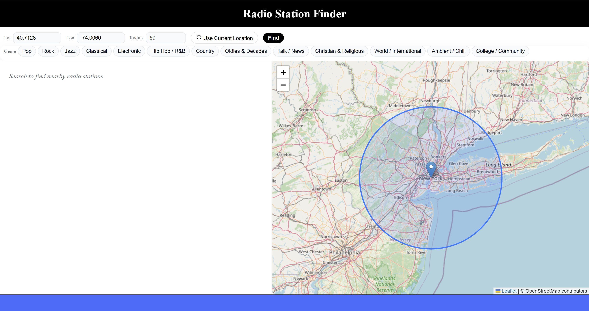
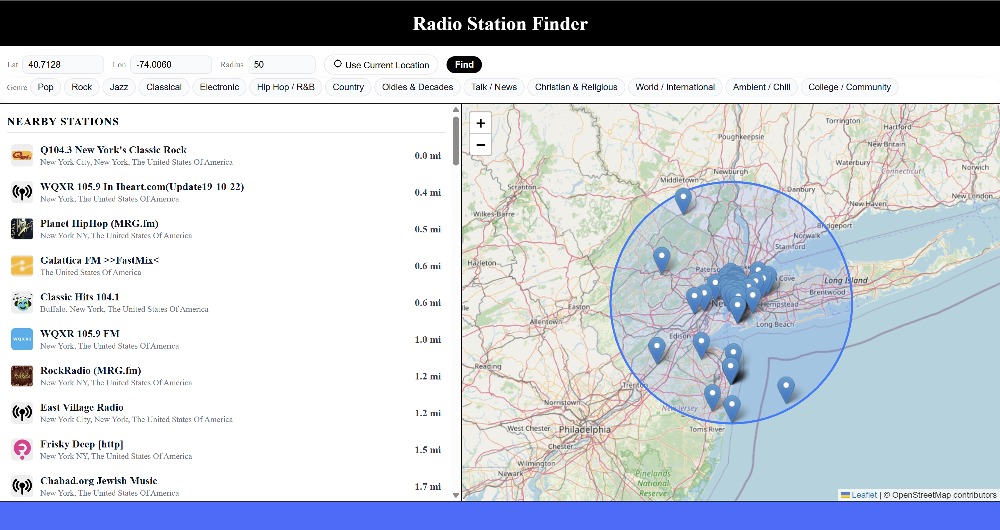
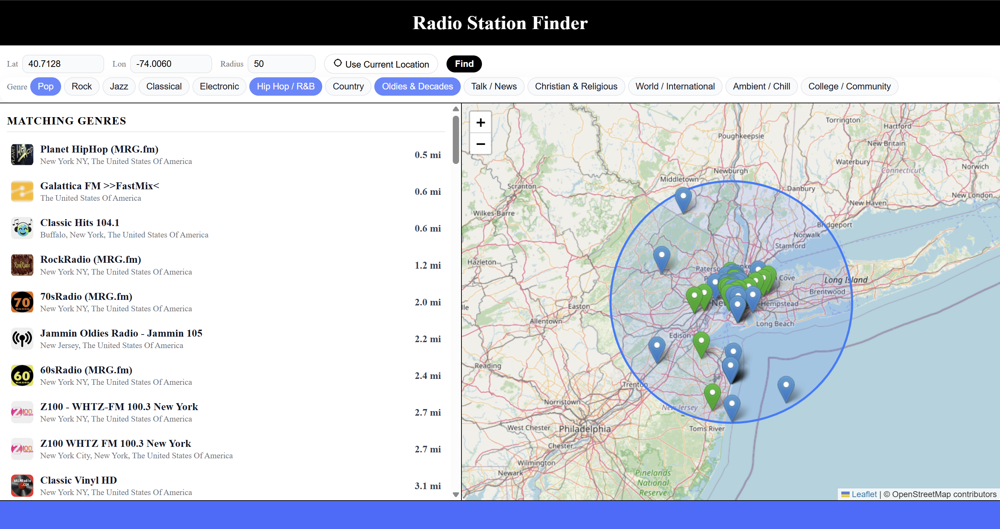
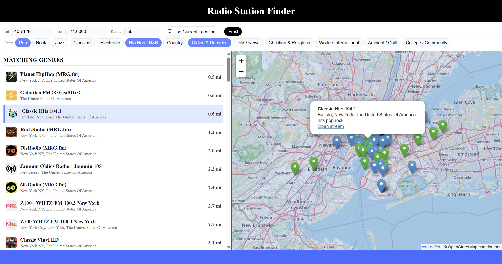

# Radio Browser Web

> An interactive web app for discovering nearby radio stations by location and genre.

Radio Browser Web is a lightweight, end-to-end system that helps users explore local radio stations anywhere in the world.  
It combines geolocation, map-based visualization, and real-time filtering to make radio discovery intuitive and visual.

## Demo
<p align="center">
  
  <br/>
  <em>Landing view — enter coordinates or use live location to begin discovering nearby radio stations.</em>
</p>
<p align="center">
  
  <br/>
  <em>Default results view — nearby stations are listed and mapped after a search, showing distance and location context.</em>
</p>
<p align="center">
  
  <br/>
  <em>Optional genre filtering — toggle one or more genres to surface stations that match your taste.</em>
</p>
<p align="center">
  
  <br/>
  <em>Synchronized map and list — selecting a station highlights it and pans the map for spatial context.</em>
</p>

## Features
- 
- 
- 
- 

## Tech Stack
- Frontend: HTML, CSS, JavaScript  
- Mapping: Leaflet.js (interactive map + markers)  
- Backend: Node.js, Express  
- APIs: Radio Browser API (station discovery and metadata)  
- Browser APIs: Geolocation API (live location lookup)  
- Data Processing: Server-side deduplication, distance sorting, and genre bucketing  
- Hosting: Local Node server + static frontend (easily deployable to GitHub Pages / Render / Railway)

## How It Works
- 
- 
- 
- 

## Getting Started

### Prerequisites
- 

### Installation
```bash
# commands go here
```

### Running the App
```bash
# commands go here
```

## Configuration
(If any environment variables are needed)

## Roadmap
- Deploy the app publicly (GitHub Pages + hosted backend)
- Add audio playback directly in the browser
- Persist user preferences (last location, favorite genres)
- Improve mobile layout and touch interactions
- Add station previews and richer metadata
- Cache recent results to reduce API calls
- Expand radio database size

## Credits
- Radio Browser API  
- Any libraries you want to acknowledge
